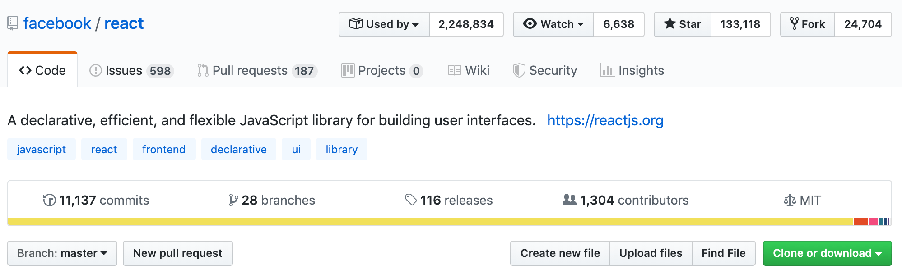

# 每周分享第 0001 期

## 智能电子锁

现在住的房子用的是电子锁，看了一下后台，上面清晰的记录着每次开门的时间，精确到秒钟，还有筛选功能，有一种深深的被监控的感觉。生活在这个互联网、大数据的时代，我们的生活依赖于太多的其他的应用，但同时我们生活中的点滴也被这些应用不断记录着，感觉是一个没有隐私的年代。最安全的可能还是回到上个世纪的时代，用普通的锁，没有人会记录。但这个真的好吗，我们需要在这中间找到一个平衡点，我们有的时候不希望别人知道我们的事情，而有的的时候又非常想要别人了解自己，疯狂发微博朋友圈。在这个大数据的互联网时代，对于自己的隐私，也许需要换一种看法，让别人了解你更多的事情，对世界开放，也许会是更加安全的行为，可以享受到更多。

## Effective Notes

1. [VSCode 插件 Live Server](https://marketplace.visualstudio.com/items?itemName=ritwickdey.LiveServer)

   在维护一些老的项目的时候，webpack 和 gulp 的配置都非常老，没有 hot-reload 又不想去修改现有的配置，[Live Server](https://marketplace.visualstudio.com/items?itemName=ritwickdey.LiveServer) 是一个轻量级的替代方案，在不改动现有配置的情况下，低成本实现 hot-reload

2. VSCode 快捷键

   关掉了 VSCode 右边默认的菜单，改为用快捷键替代，最开始不太习惯，在习惯了了一两天之后，效率还是会比之前高的。VSCode 有好的的快捷键，一个一个去背非常耗时间，同时也会容易忘。我记忆快捷键的方式基本都是通过 `command + shift + p` 输入想要的操作，然后后面会有相应的快捷键提示来记忆，在需要的时候记忆速度会快很多，分享几个日常觉得非常好用的快捷键命令。

   - Show SCM: `control + shift + g` 打开 git
   - Show Explore: `command + shift + e` 打开文件浏览
   - Open Recent: `control + r` 打开最近项目，用来快速切换项目
   - Split Editor: `command + \` 分屏

## React 源码解读

想想接触已经有好多年了，一直没有好好去研究源代码的实现，GitHub 上 React 已经有了 11K+ 的 commit，非常庞大的工程，接下来的几期，会分享探索源码过程中的一些收获

### 启动项目

刚下载完 React 原码，准备读一波，很自然的运行 `npm install` 然而为报错，好吧，看来是得用 FB 自家的 `yarn` 了

- `npm install -g yarn`
- `yarn`

执行完之后基本安装好了初步的依赖了，接下来了可以开始看代码了，然而用 VSCode 一打开，发现是一堆的报错，查了一波是由于 Flow 和 TypeScript 冲突了，[详细解释](https://github.com/flowtype/flow-for-vscode#setup)

- 安装 [Flow Language Support](https://marketplace.visualstudio.com/items?itemName=flowtype.flow-for-vscode)
- 然后进入 Workspace Settings，搜索 `javascript.validate.enable` 修改 false

至此，可以愉快地开始看原码了
